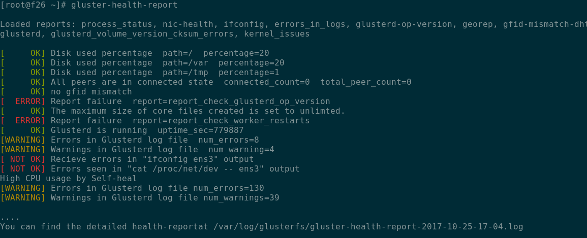

# Gluster Health Report Tool

Use this tool to analyze the Gluster node for correctness or health.

**NOTE**: This project's goal is not to improve 'monitoring' capabilities
of Gluster, but to make sure we don't miss analyzing something important
when an issue happens. Also recommend it to be run daily if some one
doesn't have any other monitoring setup, but not more frequent than that.

## Contributing

To contribute reports, please see [CONTRIBUTING](CONTRIBUTING.md).

## Install

    pip install gluster-health-report

## Usage

    gluster-health-report

or run `gluster-health-report --help` for more details.

## Example Output

## TODO

- [ ] Execute report functions in parallel
- [ ] Add configuration for `reports-dir`
- [ ] Support for multiple profiles like "cluster-reports", "node-reports" etc
- [ ] Add more reports
- [X] Add support for bash reports
